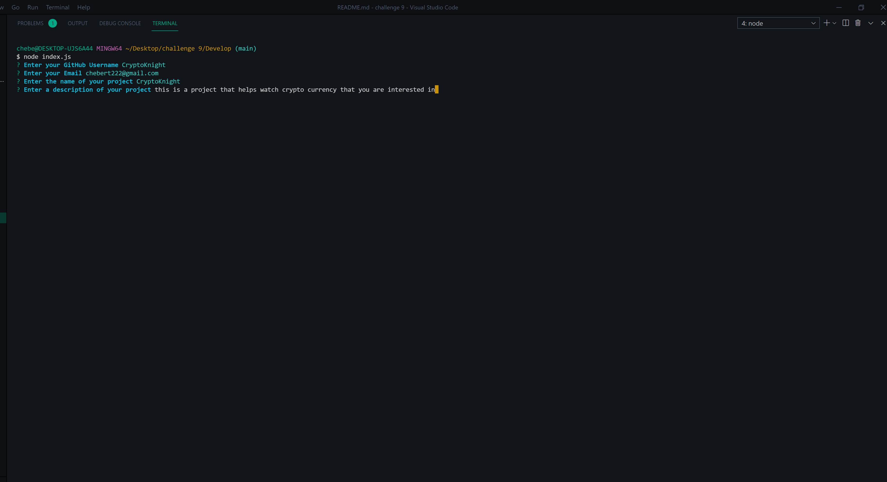
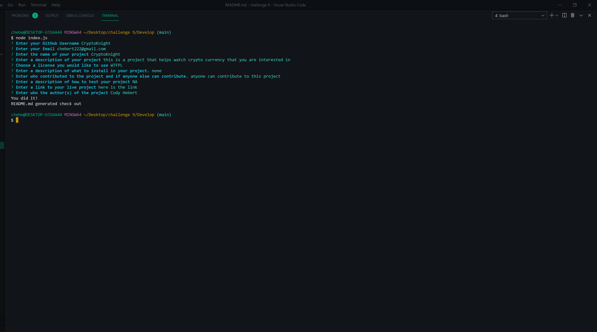
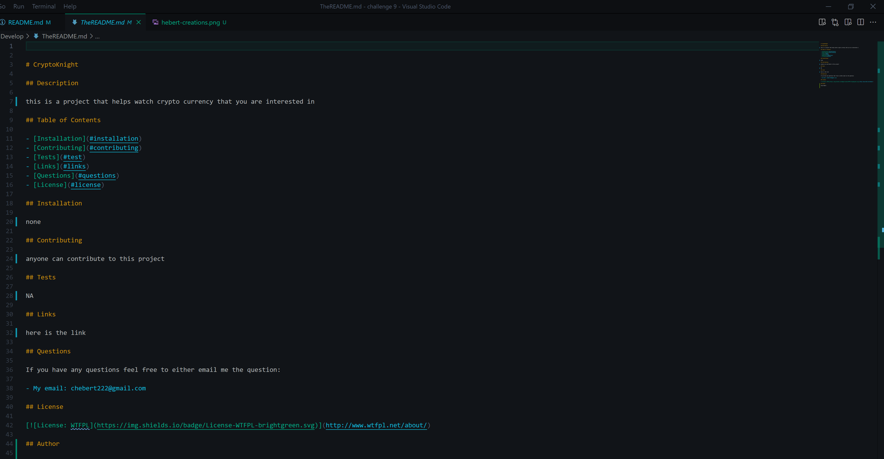

# README.md generator

## Description

this node app will prompt you with questions to make a fully formed README.md

## Table of Contents

- [Installation](#installation)
- [Contributing](#contributing)
- [Tests](#test)
- [Links](#links)
- [Questions](#questions)
- [License](#license)
- [Author](#author)

## Installation
- inquirer
- node.js

- video installation link
https://youtu.be/gWtC2OhBBjI

## Contributing

this project is open for anyone to contribute to as long as they make a issue first.

## Tests

this project is fully functional and no testing is needed

## Links

- github link https://github.com/CdHebert/readme-generator

## Questions

If you have any questions feel free to either email me the question:

- My email: chebert222@gmail.com

## License

## Author

Cody Hebert

